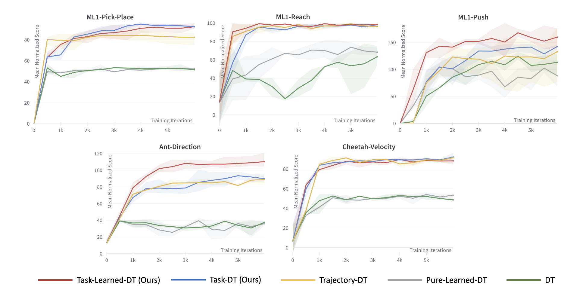
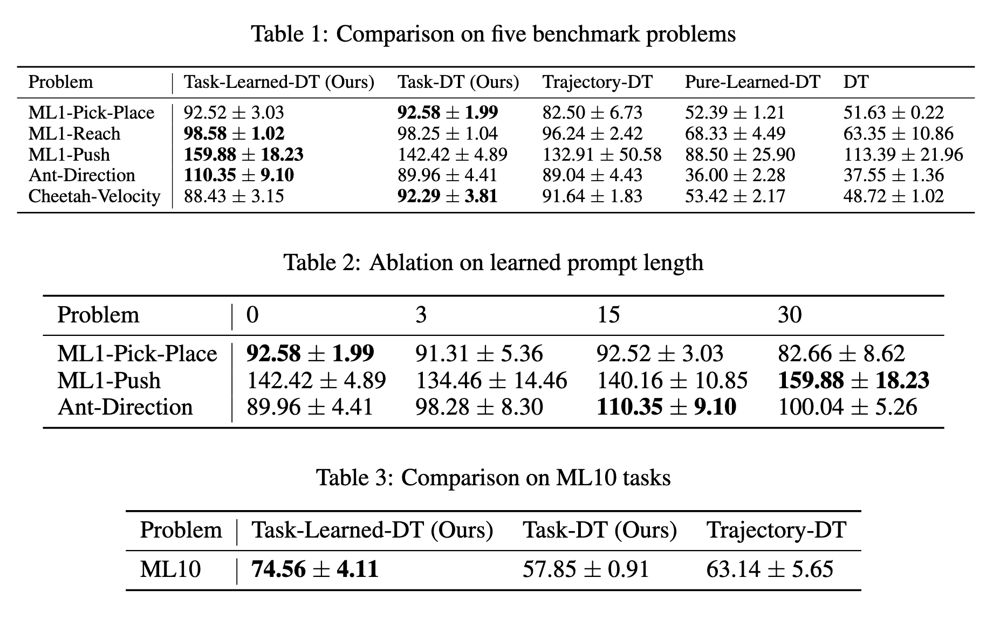

# Acute Zero-Shot Imitation Learning with Task Prompting

<div align="center">  </div>

## Setup

Organize directories in this structure:

```
.
├── assets/
├── configs/
├── data/
│   ├── ant_dir/
│   ├── cheetah_dir/
│   ├── cheetah_vel/
│   ├── ...
├── envs/
│   ├── metaworld/
│   ├── mujoco-control-envs/
├── install_envs.sh
├── prompt_dt
├── README.md
├── requirements.txt
├── setup.py
```

To install requirements:

```setup
conda create --name prompt-dt python=3.10.10
conda activate prompt-dt
pip install -r requirements.txt
./install_envs.sh
```

- Our code was run on Ubuntu 22.04
- Note that mujoco-py depends on MuJoCo. Installation instructions can be found [here](https://github.com/openai/mujoco-py)

## Training + Evaluation

To train the model(s) in the paper, modify `main` in **prompt_dt/pdt_main.py** and run this command in **prompt_dt**:

```train
python pdt_main.py
```

To run evaluations, modify `main` in **prompt_dt/pdt_main.py** to include the
following, then run `python pdt_main.py`:

```eval
experiment_mix_env(config_filename="yaml_file_name_specified_in_configs_dir", mode="eval") # mode: ['train', 'eval', 'demo']
```

## Results
<div align="center">  </div>

## Acknowledgements
Our code is based primarily on [prompt-dt](https://github.com/mxu34/prompt-dt/)
